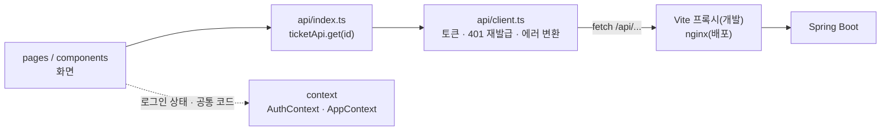
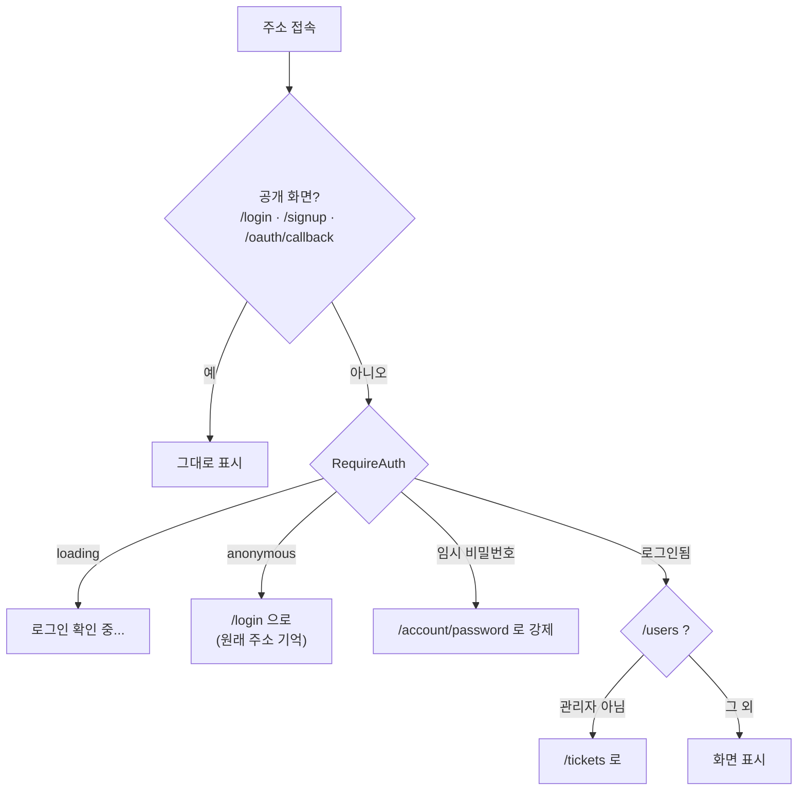
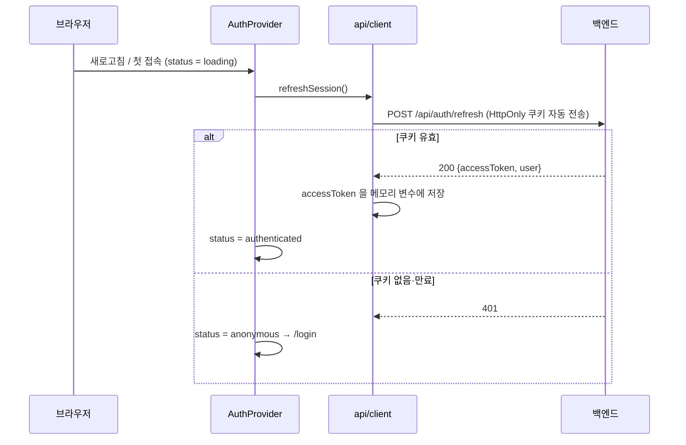
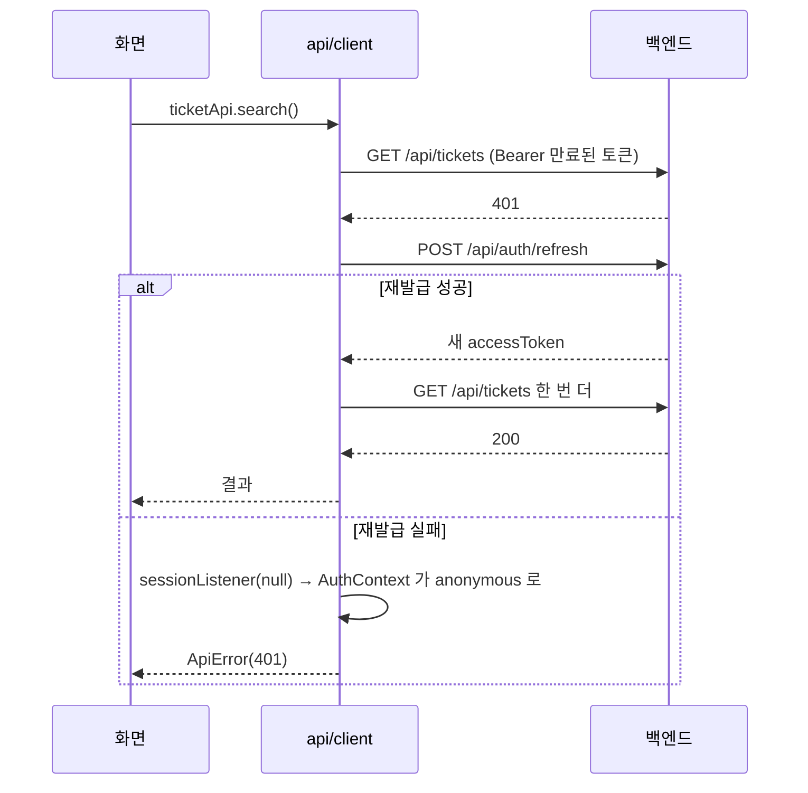

# IT 헬프데스크 토이 프로젝트 — 프론트엔드 코드 리뷰 문서

> 프론트엔드 `toy-pj-fe` (React) · 백엔드 `toy-pj-be` (Spring Boot)
> 작성 기준: 2026-09-29 / 프론트 테스트 47개(Vitest) · 소스 약 3,500줄
> 백엔드 설계·API 는 백엔드 리뷰 문서(`toy-pj-code-review.md`)를 함께 봐 주세요.

---

## 0. 이 문서의 목적과 작성자 역할

이 문서는 리뷰어가 **"화면이 어떤 순서로 백엔드와 대화하고, 왜 이렇게 만들었는지"** 를 빠르게 파악하도록 정리한 것입니다.

작성자는 백엔드(FastAPI) 위주로 개발해 왔습니다. 그래서 프론트 구조도 **백엔드 개념과 짝지어** 이해하며 진행했습니다(6장).

**작성자가 직접 한 것**

- 화면 구성과 권한별 메뉴 결정 (관리자: 대시보드·티켓·자산·AI·사용자 / 일반 사용자: 내 티켓·내 자산·AI)
- 백엔드와의 연동 방식 결정: 같은 주소(nginx) 사용, access token 은 메모리, refresh token 은 쿠키
- SNS 로그인 화면 흐름(버튼 → 제공자 → `/oauth/callback`)을 백엔드 흐름에 맞춰 설계

**AI 도구(Claude)의 보조를 받은 것**

- 화면 코드 작성, 테스트 코드, nginx·Vite 프록시 설정, 문서 정리

---

## 1. 한눈에 보기


| 항목       | 내용                                                                                 |
| -------- | ---------------------------------------------------------------------------------- |
| 역할       | 헬프데스크 사용자 화면 (티켓 접수·조회, 처리, 자산, 대시보드, AI 챗봇, 사용자 관리)                               |
| 기술       | React 18, TypeScript 5, Vite 5, React Router 7                                     |
| 외부 라이브러리 | **react, react-dom, react-router-dom 3개뿐** (상태 관리·HTTP 라이브러리 없이 `fetch` + Context) |
| 테스트      | Vitest + Testing Library (47개)                                                     |
| 배포       | Docker 멀티 스테이지 → nginx 가 정적 파일 제공 + `/api` 를 백엔드로 전달                               |
| CI       | GitHub Actions: lint → test → build(타입 검사 포함) → Docker 이미지 빌드 검증                   |


---

## 2. 구조

### 2.1 폴더 구조

```
src/
├── main.tsx            앱 시작점 (StrictMode)
├── App.tsx             라우팅(화면 주소 ↔ 페이지) + 상단 메뉴(Layout)
├── api/
│   ├── client.ts       fetch 공통 처리: 토큰 첨부, 401 → 재발급 후 재시도, 에러 변환, 타임아웃
│   ├── index.ts        백엔드 API 목록 (authApi, ticketApi, assetApi …)
│   └── types.ts        백엔드 DTO 와 같은 모양의 TypeScript 타입
├── context/
│   ├── AuthContext.tsx 로그인 상태 (loading / authenticated / anonymous)
│   └── AppContext.tsx  공통 코드(enum → 한글), 관리자용 사용자 목록
├── components/         여러 화면에서 쓰는 부품 (RouteGuards, NotificationBell, TicketComments …)
├── pages/              화면 단위 (LoginPage, TicketList, TicketDetail, Dashboard …)
└── utils/              순수 함수 (날짜 형식, 비밀번호 규칙, SNS 로그인 보조, 파일 저장)
```

### 2.2 계층 — 화면에서 서버까지




| 계층                 | 하는 일                            | 하지 않는 일           |
| ------------------ | ------------------------------- | ----------------- |
| pages / components | 화면 그리기, 입력 받기, 결과 표시            | URL 문자열 조합, 토큰 처리 |
| `api/index.ts`     | 엔드포인트를 함수로 이름 붙이기               | 에러 처리 방식 결정       |
| `api/client.ts`    | 인증 헤더, 재발급, 타임아웃, `ApiError` 변환 | 화면 로직             |
| context            | 로그인 상태·공통 데이터를 앱 전체에 공유         | 개별 화면 데이터 보관      |


---

## 3. 화면 흐름

### 3.1 라우팅과 접근 제어



- 첫 화면(`/`)은 관리자면 대시보드, 일반 사용자면 내 티켓으로 보냅니다.
- `RequireAdmin` 은 **메뉴를 숨기는 용도**일 뿐이고, 실제 권한 검사는 백엔드가 합니다(주석에도 명시).

### 3.2 앱 시작 시 로그인 복구



access token 을 **메모리에만** 두기 때문에 새로고침하면 사라집니다. 그래서 앱 시작 때마다 쿠키로 다시 받아옵니다.

### 3.3 API 호출 중 토큰 만료 (401 → 재발급 → 재시도)



- 여러 요청이 동시에 401 을 받아도 **재발급 요청은 한 번만** 보냅니다(진행 중인 Promise 공유).
refresh token 이 1회용(rotation)이라, 두 번 보내면 두 번째가 실패해 로그아웃되기 때문입니다.
- `/api/auth/*` 요청은 재시도 대상에서 뺐습니다(로그인 실패를 재발급으로 착각하지 않도록).

### 3.4 SNS 로그인

1. 로그인 화면의 SNS 버튼은 `fetch` 가 아니라 **페이지 이동**(`<a href="/oauth2/authorization/google">`)입니다.
 누르기 전에 원래 가려던 주소를 `sessionStorage` 에 맡깁니다.
2. 제공자 로그인이 끝나면 백엔드가 refresh 쿠키를 심고 `/oauth/callback` 으로 보냅니다.
3. 이 페이지는 전체 새로고침으로 열리므로 3.2 의 로그인 복구가 그대로 동작합니다. 성공하면 맡겨 둔 주소로, 실패하면 `/login?error=AUTH011` 로 이동합니다.
4. 맡겨 둔 주소는 `isSafeReturnPath()` 로 검사해 **우리 사이트 안의 경로만** 허용합니다(`//evil.com` 차단).

### 3.5 티켓 상세 — 버튼은 서버가 정한다

- 상세 응답의 `nextStatuses` 를 그대로 버튼으로 그립니다. 프론트에는 상태 전이 규칙이 **없습니다**.
- 모든 변경(배정·상태·재분류)은 `run()` 한 함수로 처리합니다. 성공하면 서버 응답으로 화면을 갈아끼우고, 실패하면 서버 메시지(예: T002)를 보여 줍니다.
- 일반 사용자는 본인 티켓이 `OPEN` 일 때 "접수 취소" 버튼만 보입니다(백엔드 규칙과 동일).

---

## 4. 기능별 구현 포인트


| 기능         | 구현                                                                       | 파일                                  |
| ---------- | ------------------------------------------------------------------------ | ----------------------------------- |
| 검색 조건 유지   | 조건을 URL 쿼리(`?status=OPEN&page=1`)에 저장 → 새로고침·뒤로가기·대시보드 링크에서도 유지          | `pages/TicketList.tsx`              |
| 티켓 접수      | AI 분류 미리보기(`/api/ai/triage`) 후 접수. 일반 사용자는 우선순위를 보내지 않음(서버가 무시하는 규칙과 일치) | `TicketList.tsx` (TicketCreateForm) |
| AI 챗봇 → 티켓 | 챗봇 화면에서 "티켓으로 접수" 시 제목·내용을 라우터 state 로 넘겨 접수 폼에 채움                       | `pages/AiSupport.tsx`               |
| 공통 코드      | 앱 시작 시 `/api/codes` 한 번 조회 → `label('ticketStatus', 'OPEN')` = "접수대기"    | `context/AppContext.tsx`            |
| 알림         | 60초마다 + 화면 이동 시 조회. 실패해도 화면 사용을 막지 않음                                    | `components/NotificationBell.tsx`   |
| 첨부 다운로드    | 인증 헤더가 필요해 `<a href>` 대신 fetch → Blob → 임시 링크로 저장                        | `utils/file.ts`                     |
| 첨부 업로드     | 5MB·확장자를 화면에서 먼저 막고, 최종 검증은 서버                                           | `components/TicketAttachments.tsx`  |
| 에러 표시      | 서버 `ErrorResponse` → `ApiError`. 5xx 면 요청 ID 를 붙여 문의할 때 쓰게 함             | `api/client.ts`                     |
| 임시 비밀번호    | 비밀번호를 바꾸기 전까지 변경 화면으로 강제, 알림·사용자 목록 API 호출 생략(서버가 403)                   | `RouteGuards.tsx`, `App.tsx`        |


---

## 5. 왜 이렇게 설계했나


| #   | 결정                                              | 이유                                               | 버린 대안                            |
| --- | ----------------------------------------------- | ------------------------------------------------ | -------------------------------- |
| 1   | access token 은 메모리, refresh token 은 HttpOnly 쿠키 | XSS 가 생겨도 스크립트가 refresh token 을 읽을 수 없음          | localStorage 저장 → XSS 한 번에 토큰 탈취 |
| 2   | 재발급 요청을 Promise 로 공유                            | refresh token 이 1회용이라 동시 재발급 시 한쪽이 실패해 로그아웃됨     | 요청마다 재발급                         |
| 3   | 화면과 API 를 같은 주소로 (Vite 프록시 / nginx)             | CORS 설정 불필요, `SameSite=Strict` 쿠키가 그대로 전송됨       | 다른 도메인 → CORS·쿠키 설정 복잡           |
| 4   | 상태 전이 규칙을 프론트에 두지 않고 `nextStatuses` 사용          | 규칙이 한 곳(백엔드)에만 있어 화면과 서버가 어긋나지 않음                | 프론트에 같은 규칙 복사 → 한쪽만 고치는 실수       |
| 5   | API 호출을 `api/` 한 곳에 모음                          | 화면은 `ticketApi.get(id)` 만 알면 됨, 주소가 바뀌어도 한 곳만 수정 | 화면마다 `fetch('/api/…')`           |
| 6   | 검색 조건을 URL 에 저장                                 | 새로고침·공유·뒤로가기에서 조건 유지, 대시보드 카드 → 조건 걸린 목록으로 바로 이동 | 컴포넌트 state → 새로고침하면 초기화          |
| 7   | SNS 로그인 후 토큰을 URL 로 받지 않음                       | 주소는 방문 기록·서버 로그·Referer 에 남음                     | `?token=...`                     |
| 8   | 요청마다 타임아웃(30초, 재발급 10초)                         | 서버가 멈춰도 화면이 영원히 "불러오는 중"에 머물지 않게                 | 타임아웃 없음                          |


---

## 6. 리뷰어가 보면 좋은 곳


| 우선순위 | 파일                                                            | 확인 포인트                                                       |
| ---- | ------------------------------------------------------------- | ------------------------------------------------------------ |
| ★★★  | `src/api/client.ts`                                           | 토큰 보관 위치, 401 재시도 조건, 재발급 중복 방지, 타임아웃, 에러 변환                 |
| ★★★  | `src/context/AuthContext.tsx`                                 | 앱 시작 시 로그인 복구, 재발급 실패 시 상태 전환                                |
| ★★★  | `src/pages/OAuthCallbackPage.tsx`, `src/utils/socialLogin.ts` | open redirect 방지, StrictMode 에서 두 번 그려져도 안전한지                |
| ★★   | `src/components/RouteGuards.tsx`                              | 로그인·임시 비밀번호·관리자 분기                                           |
| ★★   | `src/pages/TicketDetail.tsx`                                  | `nextStatuses` 로 버튼 생성, 변경 요청 공통 처리                          |
| ★★   | `src/pages/TicketList.tsx`                                    | URL 쿼리 기반 검색, 접수 폼(AI 미리보기)                                  |
| ★    | `nginx.conf`, `vite.config.ts`                                | 프록시 경로(`/api`, `/oauth2`, `/login/oauth2`), 업로드 크기, 요청 ID 전달 |


---

## 7. 알려진 한계와 개선 과제


| 구분      | 내용                                                                    | 개선 방향                                            |
| ------- | --------------------------------------------------------------------- | ------------------------------------------------ |
| 응답 순서   | 티켓 상세·목록에서 조건을 빠르게 바꾸면 **늦게 도착한 이전 응답이 최신 화면을 덮을 수 있음** (요청 취소 처리 없음) | `useEffect` 정리 함수에서 `AbortController` 로 이전 요청 취소 |
| 입력 검증   | `/tickets/abc` 처럼 숫자가 아닌 id 로 들어오면 `NaN` 으로 요청해 서버 400 을 그대로 보여 줌     | id 검사 후 404 화면                                   |
| 다운로드    | `saveBlob` 이 클릭 직후 바로 임시 URL 을 해제 → 일부 브라우저에서 다운로드가 실패할 수 있음          | `setTimeout` 으로 해제를 조금 늦춤                        |
| 알림      | 탭이 백그라운드여도 60초 폴링 계속                                                  | `document.visibilityState` 확인, 필요 시 SSE          |
| 데이터 캐시  | 화면마다 직접 조회 → 같은 데이터를 여러 번 요청                                          | 규모가 커지면 React Query 등 도입 검토                      |
| 테스트 범위  | 단위·컴포넌트 테스트 위주, 실제 백엔드와 붙인 E2E 테스트 없음                                 | Playwright 로 로그인 → 티켓 접수 → 처리 시나리오               |
| 프로젝트 분리 | 백엔드와 마찬가지로 프로젝트(고객사) 선택 개념 없음                                         | 백엔드 2단계 계획과 함께 화면에 프로젝트 전환 추가                    |


---

## 8. 관련 문서

- 백엔드 리뷰 문서 `toy-pj-code-review.md` (시스템 흐름, 설계 이유, API)
- 노션 `토이 플젝` → API 명세서(43개), 시퀀스 &amp; 유스케이스 &amp; 시스템 아키텍쳐
- 저장소 `README.md` (실행 방법, 스크린샷)

